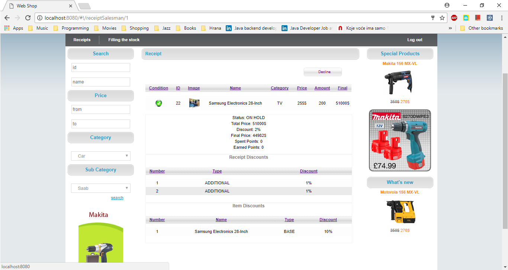
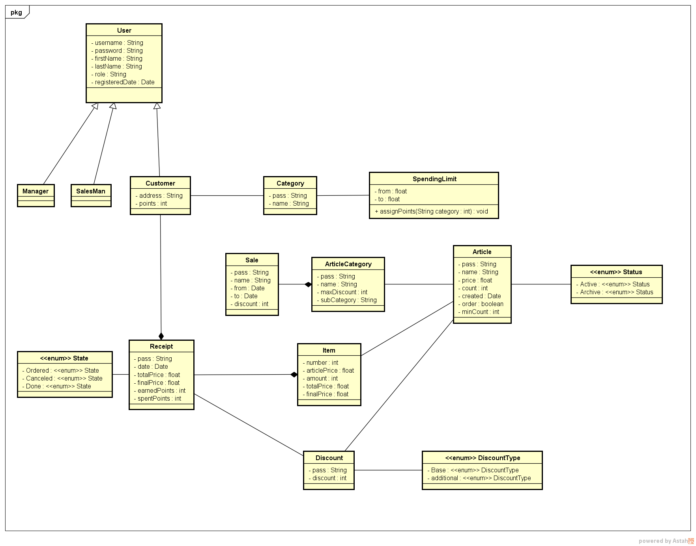

# Web shop

This is a web shop app. This web shop enable various discounts for customers: discounts based on amount of the bought items, discounts based on total bill payment, discounts for special articles, sales discounts, additional discounts which are related to shopping history of the customer. Also there is a implemented rules for limitation of discounts when customer achieve multiple discounts. All this features are implemented using a Drools (Business Rules Management System). Drools together with Java (Spring Framework) make back-end side. Front-end is implemented using AngularJS.

## Class Diagram

